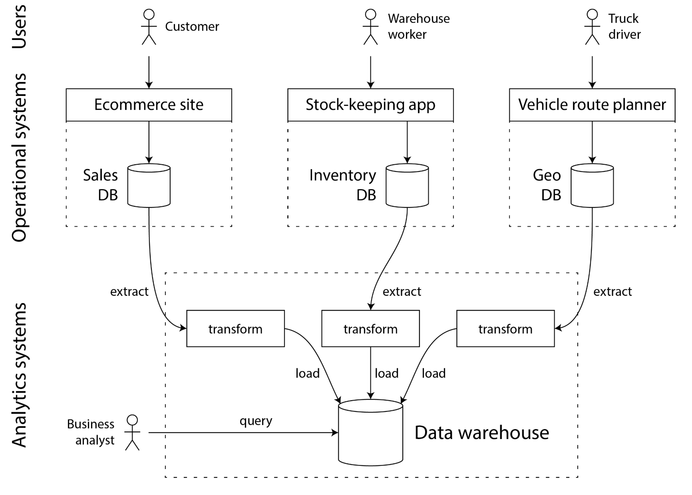

# Chapter 1: Trade-offs in Data Systems Architecture

> "There are no solutions, there are only trade-offs. […] But you try to get the best trade-off you can get, and that’s all you can hope for."
> - Thomas Sowell, Interview with Fred Barnes (2005)

## 핵심 개념

- 운영 시스템 vs 분석 시스템
- 트랜잭션 처리와 분석의 특성
- 기록 시스템(System of Record) vs 파생 데이터(Derived Data)
- 분산 시스템 vs 단일 노드 시스템의 트레이드오프

## 요약

- 데이터는 애플리케이션 개발의 핵심이다.
- 생성된 데이터는 활용 될 수 있어야한다.
- 소향의 데이터는 다루기 쉽다.
- 대량의 데이터, 대량의 쿼리 빈도는 다루기 까다롭다. 
  - 서로 다른 기능을 가진 스토리지, 여러 처리 시스템을 결합해 처리해야할 수 있다.
  
### Compute-intensive Versus Data-Intensive system
- Compute-intensive 시스템: 매우 큰 연산을 병렬처리에 관심
- Data-intensive 시스템: 데이터 저장, 큰 데이터 처리, 데이터 변경 관리, 장애 및 동시성 상황에서 일관성 보장, 고가용성 보장에 관심

> Data-Intensive 시스템은 다음과 같은 표준 구성 요소가 특징
> 1. Database - 저장, 조회 가능
> 2. Caches - 비용 많이 드는 작업 결과 캐시하여 읽기 속도 향상
> 3. Search Index - 사용자가 키워드 검색, 다양한 필터링 가능해야한다.
> 4. Stream processing - 이벤트 및 데이터 변경 사항을 즉시 처리
> 5. Batch Processing - 주기적으로 대량의 누적된 데이터 처리

애플리케이션이 커질 수록 여러 어려움에 직면한다.

주어진 어려움에는 적합한 도구와, 적합한 접근 방식이 필요하다.
- 각기 다른 기능, 용도를 가진 데이터베이스
- 다양한 캐싱 방식
- 다양한 검색 인덱스 구축 방법 
- 등등

> 어떤 기술을 사용하고, 어떻게 조합해 요구사항에 가장 적합한 접근 방식을 찾을 것인가

---

# Operational Versus Analytical Systems

기업에는 데이터를 다루는 다양한 유형의 사람들이 있다.
- 백엔드 엔지니어
- 비즈니스 분석가(Business Intelligence)
- 데이터 과학자(머신러닝/AI)

### Characterizing Transaction Processing and Analytics

운영 시스템과 분석 시스템은 여러가지 이유로 분리된다.

- OLTP(Online Transaction Processing): 
  - 실시간 트랜잭션 처리
  - 포인트 쿼리, 고정된 쿼리 세트, 데이터 최신 상태
  - 사용자 작업에 따라 데이터 생성/수정
  - 백엔드 엔지니어가 작업
- OLAP(Online Analytical Processing): 
  - 대량 데이터 분석
  - 대량 집계, 임의 질의, 데이터는 이벤트 이력
  - 읽기 전용으로 분석에 최적화
  - 비즈니스 분석가, 데이터 과학자가 작업

### Data Warehousing
- 1980년 후반, 1990년 초 OLTP을 시스템 분석 목적으로 사용하는 것을 중지
- 별도의 데이터베이스 시스템에서 분석을 실행하는 추세

> 이러한 별도의 데이터베이스를 '데이터 웨어하우스' 라고 불렀다. 

- 기업은 비즈니스가 확장하며 분산된 시스템, 분산된 데이터가 생겼다.
  - 주기적인 데이터 덤프, 지속적인 데이터 추출
  - 업데이트 스트림을 데이터를 분석하기 쉬운 스키마로 변환하고 정리
- ETL 프로세스
  - 이런 변환하여 적재하는 과정을 Extract-Transform-Load(ETL) Process라고 한다.
  - ETL 프로세스는 데이터 파이프라인으로 일반화 되었다.

- Data Lake
  - SQL을 통한 관계형 데이터 모델은 비즈니스 분석사에게는 통하지만, 데이터 과학자에게는 적합하지 않다.
  - 따라서 Data Lake라는 개념 등장함
  - 머신러닝 모델 학습에는 feature engineering(백터, 행렬 전환)이 필요한데, 이때 SQL로는 표현할 수 없는 작업들이 많음
  - pandas, scikit-learn 같은 Python 라이브러리, R, Spark 같은 도구를 사용할 수 있는 환경이 필요함
  - Data Lake를 구축하여 Avro또는 Parquet, 텍스트, 이미지, 비디오, 센서 판독값, 게놈 시퀀스 등등 모든 종류 데이터 표현해야함

### Systems of Record and Derived Data
- 기록 시스템 (System of Record)
  - 원천 데이터
- 파생 데이터 (Derived data systems) 
  - 기록 시스템에서 변환/집계된 파생 데이터
  - 캐시도 파생 데이터
  - 중복된 복사본 데이터
- 기록 시스템과 파생 데이터 간 업데이트 전파, 통합은 쉽지 않은 일이다.
- data integration, data pipeline을 통해 데이터 시스템을 조합해야한다.

---

# Cloud Versus Self-Hosting
- 조직이 가장 먼저 해야하는 질문
  - In-house로 처리할까?
  - outsource로 위탁할까?
- 누가 개발하고, 누가 배포할 것인가

### Pros and Cons of Cloud Service
- 클라우드의 장점: 탄력성, 관리 부담 감소
  - 단점: 
    - 클라우드 서비스 제어할 수 없음 
    - 공급업체에 강한 의존
- 셀프 호스팅의 장점: 통제력, 비용 예측 가능성 
- 하이브리드 방식도 많이 채택중 

### Cloud-Native System Architecture
- 클라우드 서비스를 최대한 활용하도록 설계된 아키텍처
- lower-level cloud 적재적소 활용
  - S3, VPC, EC2 ... 인프라 빌딩 블록
- higher-level cloud 적재적소 활용
  - RDS, Lambda, Snowflake ... 관리형 서비스
- storage, compute 분리 활용
  - EBS 같은 공유 스토리지 활용
  - S3에 큰 용량 저장하고 분석은 S3 외부 어딘가에서 진행

### Operations in the Cloud Era
- 전통: DBA, 시스템 관리자
- 현대: DevOps(백엔드 + 인프라 동동 책임), SRE(by Google)
  - automation: 작업 자동화 
  - enabling frequent application updates: 잦은 배포 업데이트 지원
  - learning from incidents: 사고로 부터 학습
  - preserving the organization’s knowledge about the system, even as individual people come and go : 조직의 지식 보존

---

# Distributed Versus Single-Node Systems
- 분산 시스템이 필요한 이유
  - Inherently distributed systems
    - 두 명 이상 사용자가 각자 기기로 상호작용 하는 애플리케이션
    - 필연적인 분산 시스템
  - Requests between cloud services
    - 데이터가 한 서비스에 저장되고, 다른 서비스에서 처리되는 경우
  - Fault tolerance/high availability
    - 애플리케이션 내 한대의 머신에 장애가 발생하더라도 계속 작동해야하는 경우
  - Scalability
    - 데이터 용향이나 컴퓨팅 요구 사항이 단일 머신이 처리할 수 있는 용량 초과하게 되면 여러대 컴퓨터에 부하 분산
  - Latency
    - 전 세계 사용자가 있는 경우, 각 사용자에게 지리적으로 가까운 서비스에서 통신 되도록 서버 분산
  - Elasticity
    - 특정 시간에는 사용량이 많고 다른 시간에는 유휴 상태인 경우, 분산을 이용해 확장, 축소
  - Using specialized hardware
    - 작업 특성 부하에 맞게 다양한 하드웨어 사용하도록 분산
    - 디스크는 많지만 CPU 적은 S3 활용
    - 머신러닝은 GPU 탑제 머신 사용
  - Legal compliance
    - 일부 국가는 관활권 내 사람 데이터는 해당 국가 내 지리적 저장, 처리해야하는 데이터 거주법 준수 위해 분산
  - Sustainability
    - 재생 가능한 전기가 풍부한 시간과 장소에서 전력망 부담 가중 시간 피해 분산
    - 이렇게 하면 탄소 배출량을 줄이고, 저렴한 전력 사용

### Problems with Distributed Systems
- 문제점
  - 복잡함
  - 데이터 일관성 깨짐
  - 등등
- 해결책
  - observability: 정확한 문제 진단

### Microservices and Serverless
- Microservices 
  - 일반적으로 클라이언트 서버를 나누고 REST, RPC 사용하여 통신하는 모습
  - SOA(서비스 지향 아키텍처)리고 불러옴
  - 최근에 MSA로 더욱 개념이 정교해짐
  - 사람을 팀으로 독립적으로 분리하여 일시키기 위한 기술적 솔루션
  - 대기업에서 유용, 소기업은 오버헤드
- Serverless
  - 클라우드 공급자가 서비스 요청에 따라, 리소스 자동 할당/헤제
  - 사용한 만큼 과금

---

### Data Systems, Law, and Society
- 데이터 시스템의 사회적 책임
  - 2018년 이후 유럽 GDPR, 캘리포니아 CCPA, 한국 ISMS
- 데이터 시스템 아키텍처는 시스템을 도입하는 기업의 요구사항뿐만 아니라 데이터 처리 대상자의 권리를 보호하는 개인정보 보호 규정에 의해서도 결정

## 중요 용어

| 용어 | 설명 |
|------|------|
| OLTP | Online Transaction Processing |
| OLAP | Online Analytical Processing |
| Data Warehouse | 분석을 위한 중앙 집중식 데이터 저장소 |
| ETL | Extract, Transform, Load |
| System of Record | 신뢰할 수 있는 데이터의 단일 소스 |

## 질문 & 토론

-

## 실습 / 예제

-

## 참고 자료

-

## 느낀 점

-
