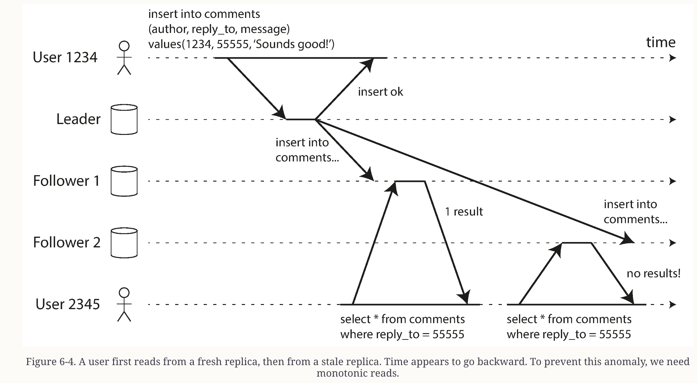
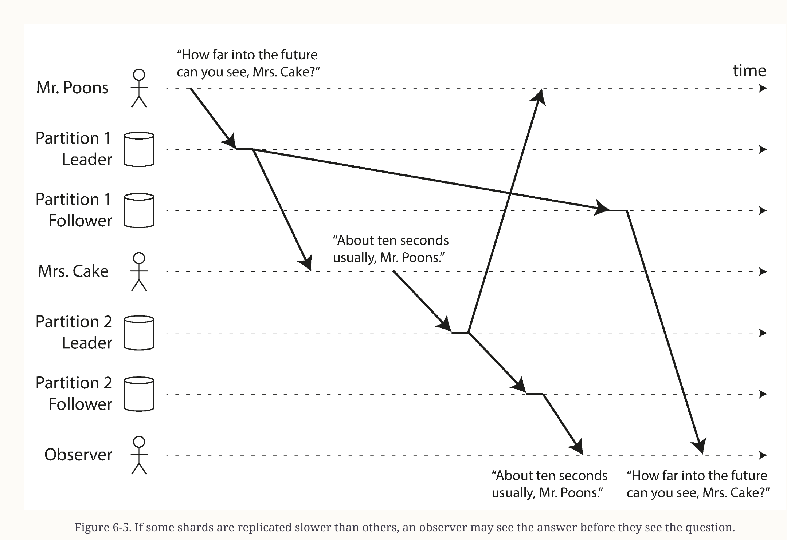
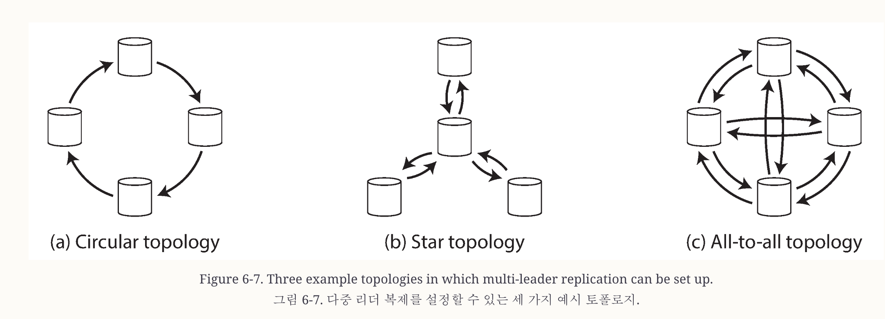

# Chapter 6: Replication

## 핵심 개념

- 복제의 목적: 고가용성, latency 감소, 읽기 확장
- 리더 기반 복제 
- 복제 지연 문제 (Replication Lag)
- 충돌 해결
- Eventual-consistency, Read-your-write, Monotonic reads

## 요약

> Replication이란 네트워크를 통해 동일한 데이터를 여러대 컴퓨터에 저장하는 것

다음과 같은 이유로 Replication을 한다.
- 데이터를 사용자와 지리적으로 가까운 곳에 보관하여 지연 시간 줄이기
- 시스템 일부가 다운 되도 동작할 수 있게 고가용성과 내구성을 목적으로
- 읽기 쿼리 처리할 수 있는 머신을 늘려 읽기 처리량을 늘리기 위해

### Single-Leader Replication
- Replica: database의 복제본

> Replica가 여러대라면 모든 데이터가 모든 복제본에 저장되도록 어떻게 보장할 수 있을끼?

#### 리더 기반 복제 (Leader-based replication, Primary-backup, Active/Passive)
- Replicas 중에 1대가 Leader(=Primary, Source)로 지정
- 클라이언트가 데이터베이스에 데이터를 쓰면, 리더가 먼저 local storage에 write
- 다른 Replicas는 followers(=Read Replica, secondaries, hot standbys)라고 하며 local storage에 데이터가 기록되면, replication log 또는 change stream의 일부로 데이터 변경 사항을 받아 데이터 업데이트
- followers는 읽기 전용으로 사용되며 쓰기는 Leader만 허용 
- 데이터베이스가 샤딩 되었다면 서로 다른 샤드가 Leader 역할 수행
- MySQL, PostgresSQL 등 단일 노드 복제 기능 내장하고 있음
- Kafka, DynamoDB 같은 곳에서도 사용중

#### 동기식 vs 비동기식 복제

> Leader와 Follower의 데이터 동기화 지연이 생길 수 있다. 어떻게 동기화 할 것인가

- semi-synchronous (준동기식)
  - followers 1대는 동기식, followers 나머지는 비동기식인 경우가 많음
  - 동기식 followers가 죽으면 다른 followers가 동기식으로 격상
- Quorums (과반수 동기식)
  - replica 5대중 3대가 동기적 업데이트하는 방식
- 전부 비동기식 
  - Leader에 장애가 발생하거나 해서, 모든 followers에 지연이 있더라도 비동기로 운영
  - 특히 followers가 많거나, replica가 지리적으로 분산된 경우 널리 사용됨

#### Setting Up New Followers

> 다운타임 없이 followers를 어떻게 추가할 수 있을까?

- Leader에 일관된 스냅샷을 특정 시점에 생성
- 스냅샷을 새 Followers 노드에 복제
- Followers는 Leader애 연결하여 스냅샷이 생성된 이후 발생 데이터 변경사항 요청
- Leader에 복제 로그 (MySQL - binlog coordinates/GTIDs, PostgresSQL - log sequence number)에서 변경사항 읽음
- Followers가 변경사항 누적 처리 완료하면 실시간으로 데이터 변경사항 처리

> Tips : 데이터 복제에 S3 같은 Object Storage를 활용하면 비용 절약 및 데이터 통합 간소화 가능

> Object Storage 단점으로 지연시간이 길다, 요즘은 계층형 스토리지 아키텍텍처 구성하여 지연 없는 메모리 storage를 섞어 사용함 (a tiered storage architecture)

#### 노드 장애 처리

> 리더, 팔로우 down 되면 어떻게 할까? 

  - 팔로워 장애: Catch-up Recovery
    - 팔로워는 리더 수신 데이터 변경 log를 저장
    - 다운되고 재시작되면 log 기반으로 쉽게 복구가 가능
    - 그러나 Leader 데이터 처리향이 너무 많거나, 팔로워가 너무 오랫동안 죽었다면 리더에 부하가 발생할 수 있다.
  - 리더 장애: Failover
    - 다음 과정을 failover라고 한다
      - Leader가 죽음 -> followers중 하나가 Leader로 승격 -> followers들이 새 leader를 바라보록 재구성 
    - Leader가 죽은 것은 time-out으로 감지
      - 적절한 타임아웃은 언제일까? 너무 짧으면 불필요한 failover 발생
    - Failover에는 많은 사이드이펙트 가능성 있음
      - Redis 동기화 문제
      - 데이터 유실, 손상 문제
      - 서로 Leader가 되려는 경합 (Split brain)
    - 가장 중요한 것은 가장 최신 상태의 팔로워를 Leader로 선택하는 것

> 노드 장애, 불안정한 네트워크, 복제본 일관성, 내구성, 가용성 및 지연 시간 등은 시스템의 근본적인 문제

#### 복제 로그 구현 방식

- Statement-based replication
- Write-ahead log (WAL) Shipping
- Logical(row-based) log replication

### Replication Lag (복제 지연 문제)

> Leader와 Followers는 최종 일관성(eventual consistency)으로 동작한다.

- 복제 지연으로 인해 팔로워의 데이터를 읽을때 outdated 정보를 읽을 수 있다.
- 복제 지연은 상황에 따라 몇 초 또는 몇 분까지 늘어날 수 있다.
- 문제 상황을 살펴보고 해결 접근 방식을 살펴보자.

#### Reading Your Own Writes (자신이 쓰는 글 읽기)
- 문제
  - 토론 게시판이나 댓글 작성 후 읽는 경우
  - 쓰기 직후 읽었을때 데이터가 조회 안되는 상황 있을 수 있음
- 해결책
  - read-after-write consistency
  - 사용자가 새로고침하면 자신이 제출한 모든 업데이트 내용이 표시된다는 보장
    - 다른 사용자 내용은 나중에 표시 될 수 있음
  - 사용자가 write했을 가능성 있는 정보 읽을때는 Leader 또는 동기적으로 업데이트 되는 Follower에서 읽는 방식
  - SNS 같은 경우 마지막 업데이트 시간을 추적해서 마지막 업데이트 후 1분 동안은 읽기를 Leader에서 수행하는 방법 도 있음
  - 

#### Monotonic Reads (단조 읽기)
- 문제
  - 다른 사용자가 읽을때 컨텐츠가 등장했다가 사라지는 이상 현상 
  - 
- 해결책
  - Monotonic Reads
  - 회신 데이터를 읽은 후에 이전 데이터를 읽지 않게 하는 방법
  - 각 사용자가 항상 동일한 복제본에서 읽기를 수행하도록 함 (사용자 해시 값 기반)

#### Consistent Prefix Reads
- 문제
  - 인과관계 위반
  - 대화의 순서가 뒤죽박죽하게 읽어지는 이상현상
  - 주로 샤딩된 데이터베이스에서 발생하는 문제
  
- 해결책
  - Consistent Prefix Reads
  - 쓰기 작업이 특정 순서로 일어나면, 읽기도 해당 순서로 읽는 것
  - 인과관계가 있는 쓰기는 한 곳에서 이뤄지도록 함

#### Solutions for Replication Lag

> Eventual Consistent System으로 동작할때는 Replication Lag가 몇 분 또는 몇시간으로 늘어나는 경우 애플리케이션 동작을 생각해 봐야한다.

- 지연이 문제가 될 것 같으면, read-after-write 같은 더 강력한 일관성 보장 할 수 있게 설계한다.
- 가장 간단한 방법은 선형화가능성(linearizability), ACID transaction과 같은 강력한 일관성 보장 데이터베이스를 선택하는 것
- 확장성, 내결함성, 트랜잭션 갖춘 분산 데이터베이스가 등장
- 그럼에도 불구하고 Replication을 직법 사용하는 것 네트워크 중단에 대한 복원력이 뛰어나고 트랜잭션 시스템에 비해 오버헤드가 낮기 때문

### Multi-Leader Replication

- 쓰기를 지원하는 Leader를 다중으로 두는 방식도 있음
- 각 Leader는 다른 Leader의 follower이기도 함
- Geographically Distributed Operation (지리적 분산 운영) 사용시 유용
- MySQL 같은 많은 데이터베이스에서 멀티 리더 복제 이미 지원 함
  - 자동 증가 키, 트리거 및 무결성 제약 조건이 문제가 될 수 있음
- 복제간 데이터 동기화 토폴로지에는 여러 방법이 있지만 문제점이 많음

> 해결책으로 Version Vector라는 기법, 일관된 접두사 읽기 방법 고려 

#### 오프라인 상태에서 동작하는 앱 (feat. Sync Engine)

- 피그마 같이 여러명이 실시간으로 쓰기하는 앱이 대표적인 다중 Leader Replication이 적용된 앱
- 오프라인 편집, 실시간 공동 작업 모두 유사한 복제 인프라 필요함
  - 사용자 변경 내용 캡처하여 온라인에서 전송하고, 오프라인에서는 로컬에 저장
  - 앱은 공동 작업자들의 변경사항을 수신하여 사용자 로컬 파일 복사본을 병합
  - 변경사항이 충돌할 경우 해결 로직
> 이러한 기능들을 제공하는 소프트웨어를 Sync Engine 이라 한다.
- 장점
  - 클라이언트에 영구적인 상태를 로컬에 저장하여 인터페이스와 응답 속도가 빨라짐
  - 사용자가 오프라인 상태에서 사용할 수 있는 것은 모바일 디바이스에서 특히나 유용함
  - 프론트앤드 앱의 프로그램이 모델을 단순화 함
    - 명시적 동기화 실패시 명시적 오류 처리를 해야하는데, 동기화 엔진을 사용하면 실패를 하지 않는다 가정할 수 있음
    - 선언적인 프로그래밍 스타일이 가능해짐
- 단점
  - 사용자가 접근해야할 데이터가 큰 경우 부적합
  - 다른 사용자의 수정사항을 실시간으로 표시하기 위한 알림 처리 해야함
  - 사용자 간의 쓰기 충돌이 일어난다.

#### Writers 간의 충돌 해결하기

> 동시 쓰기가 발생했을때 해결법

- Conflict 회피
  - 출돌을 예방하려면 Conflict가 나지 않으면 된다.
  - 특정 레코드에 대한 모든 쓰기가 동일한 리더를 통해 이루어지도록 보장하면 충돌이 생기지 않음
  - 새 레코드 생성할때 한 리더는 홀수만, 한 리더는 짝수만 생석하도록 설정

- Last write wins (LWW - 동시 쓰기 작업 무시)
  - 타임스탬프 기반으로 마지막 쓰기를 우선
  - 데이터 손실 감수해야함

- Manual Conflict Resolution (수동 충돌 해결)
  - 쓰기 작업 일부 손실을 허용하지 않는 다면 고려해볼 전략
  - 동시 쓰기 값을 모두 저장 후 사후처리하는 방식
    - 애플리케이션에서 자동으로 해결하거나 (B, C 저장되면 B/C로) 
    - 사용자에게 확인 요청하여 선택한 값을 기록
  - CouchDB 같은 일부 시스템에서 사용됨
  - 충돌을 애플리케이션에서 해결하기에 코드가 복잡해지는 단점 있음
  - 사용자에게 승인 받는 과정을 클라이언트 개발자가 구현해야함

- Automatic conflict resolution (자동 충돌 해결)
  - 충돌 해결 알고리즘을 통해서 Strong Eventual Consistency 보장
  - Last Write Wins 처럼 타임스탬프 기반으로 last를 최신으로 사용하겠다는 전략도 이 방식 중 하나임
  - Version + Optimistic Lock 기반
  - 대표적인 알고리즘
  
> CRDTs and Operational Transformation
- Merge Strategy (병합 전략)
  - ice -> nice
  - ice! -> nice
  - => nice!

- Conflict-free replicated datatypes (CRDTs) : 충돌 없는 복제 데이터
  - 각 문자에 변경 불가능한 ID를 부여하고 ID를 사용하여 삽입/삭제 위치를 결정하여 병합
  - Redis 같은 분산 데이터베이스에서 사용 됨
- Operational Transformation : 운영 혁신
  - 문자가 삽입되거나 삭제되는 인덱스 기록하여 인덱스 기반으로 병합 작업
  - Google Docs 실시간 공동 텍스트 편집에 사용 됨

### Leaderless Replication

- 일부 데이터 저장 시스템은 Leader라는 개념을 버리고 다른 접근 방식을 가짐
- 모든 복제본은 쓰기를 받을 수 있다
- Amazon Dynamo system (2007)을 기점으로 유행
- 클라이언트가 여러 복제본에 직접 쓰기 작업을 보내면, 코디네이터 노드가 클라이언트 쓰기를 수행 
  - 코디네이터 노드는 Leader와 다르게 복제 순서를 정하지 않고 전달
  - 응답을 모어서 성공 여부만 판단 (quorum 계산)
- Leaderless는 failover가 존재하지 않는다. (고가용성)
- 읽을때 병렬로 읽어서 타임스탬프 최신 값을 읽음
- 누락된 쓰기 작업 보정
  - Read Repair
    - 병렬로 데이터 읽을때 오래된 응답 확인하면 최신 데이터 복사
  - Hinted handoff
    - 하나의 복제본 사용할 수 없으면 다른 복제본이 쓰기 작업 대신하고 힌트 저장
    - 복구되면 힌트 전송하여 인계 작업
  - Anti-entropy
    - 백그라운드 프로세스가 주기적으로 복제본 간의 데이터 차이 확인하고 누락된 데이터 보정
- Quorums for reading and writing
  -  w + r > n 수식 보장

## 중요 용어

| 용어 | 설명 |
|------|------|
| Leader/Primary | 쓰기를 받는 주 노드 |
| Follower/Replica | 리더의 복제본을 유지하는 노드 |
| Synchronous Replication | 팔로워 확인 후 응답 |
| Asynchronous Replication | 팔로워 확인 없이 응답 |
| Failover | 리더 장애 시 새 리더 선출 |
| Quorum | 읽기/쓰기에 필요한 최소 노드 수 |
| Split Brain | 두 노드가 모두 자신을 리더로 인식 |

## 질문 & 토론

-

## 실습 / 예제

-

## 참고 자료

-

## 느낀 점

-
